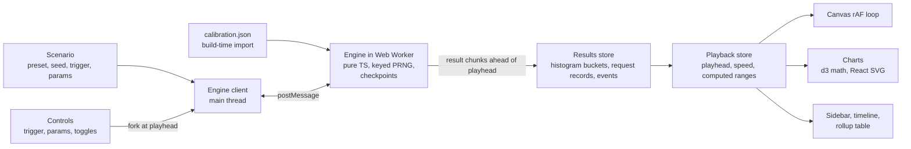
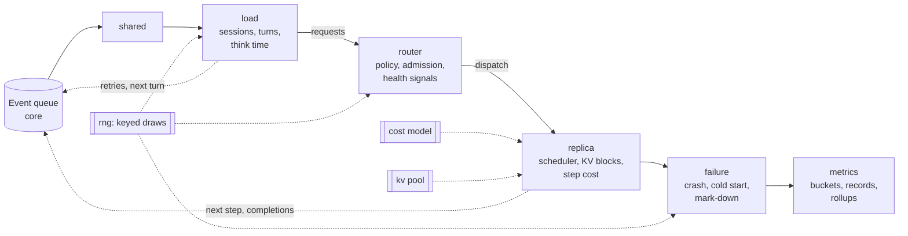
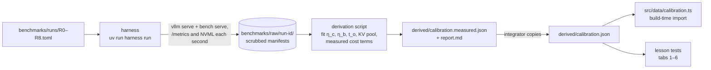
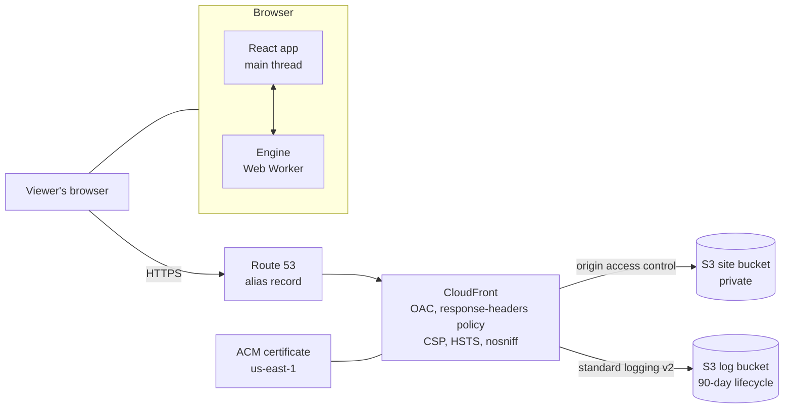
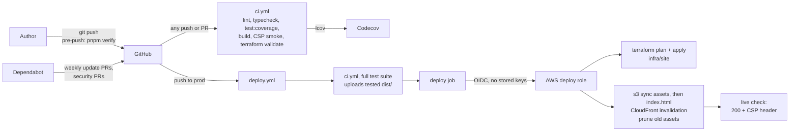

# inference-simulator

[](https://github.com/yosyp/inference-simulator/actions/workflows/ci.yml)
[](https://github.com/yosyp/inference-simulator/actions/workflows/deploy.yml)
[](https://github.com/yosyp/inference-simulator/security/dependabot)
[](https://codecov.io/gh/yosyp/inference-simulator)
[](LICENSE.md)

An interactive browser simulator of serving a large language model inside a fixed-capacity enclave: a known number of GPUs, a known analyst population, and no autoscaling. It teaches why LLM serving fails under load, one lesson per tab.

It is a static React app. A discrete-event engine runs in a Web Worker. The engine is calibrated from vLLM benchmarks of Llama 3.1 8B Instruct on NVIDIA A100 PCIe 40GB GPUs. The site is hosted on S3 and CloudFront, with no backend and no runtime network calls.

The product rationale is in `docs/01-product-and-rationale.md`.

## Contents

- [The six lessons](#the-six-lessons)
- [Quick start](#quick-start)
- [Commands](#commands)
- [Components](#components)
- [Architecture](#architecture)
- [Calibration pipeline](#calibration-pipeline)
- [Deployment](#deployment)
- [Dependencies](#dependencies)
- [Maintenance](#maintenance)
- [Documentation](#documentation)
- [License](#license)

## The six lessons

Each tab is a week of simulated traffic with one lesson moment. The tab opens just before that moment.

| Tab | Title | What it shows |
|---|---|---|
| 1 | Long prompt | A 32,000-token prompt waits 4.6 s for its first token instead of about 80 ms, while time per output token barely moves. |
| 2 | Saturation knee | A load spike pushes one GPU past its knee. TTFT p99 pulls away from the mean, and the mean hides it. |
| 3 | KV exhaustion | Long conversations fill the KV cache. nvidia-smi reads 100% while compute sits near 15%, and TTFT p99 climbs to minutes while throughput stays flat. |
| 4 | Routing | Switching from session affinity to round-robin loses prefix-cache hits, and follow-up turns get slower. |
| 5 | Fail and recover | One of eight replicas crashes and is replaced. Mod-N hashing moves most conversations away from their cached history, twice; consistent hashing moves only the lost replica's eighth. |
| 6 | Retry storm | A crash plus immediate retries overloads the survivors. Backoff with jitter and admission control stop the storm. |

Scenario definitions live in `src/scenarios/tab*/`. Each has a `lessons.test.ts` that asserts its lesson on the real engine.

## Quick start

Requires Node 22 (`.nvmrc`) and pnpm 9 (`packageManager` in `package.json`).

```bash
pnpm install     # also enables the pre-push hook (.githooks/pre-push)
pnpm dev         # http://localhost:5173
pnpm verify      # lint, typecheck, full test suite, build
```

The benchmark harness is a separate Python project. See [Calibration pipeline](#calibration-pipeline).

## Commands

| Command | What it does |
|---|---|
| `pnpm dev` | Vite dev server |
| `pnpm build` | Production build into `dist/` |
| `pnpm verify` | Lint, typecheck, full test suite, and build. Must pass before a push; the pre-push hook runs it. |
| `pnpm test [path]` | Vitest, full suite: unit tests, the 200-seed differential oracle, whole-day simulations, and lesson assertions (~4 min) |
| `pnpm test:fast` | Skips the whole-day simulation tests |
| `pnpm test:coverage` | Fast tier with V8 coverage (`coverage/lcov.info`); CI uploads it to Codecov |
| `pnpm test:oracle:long` | 5,000 oracle seeds. Run before merging engine timing changes. |
| `pnpm e2e` | Production build plus a Playwright smoke test under the production CSP |
| `pnpm sim <tab> [...]` | Runs a scenario headless and prints its lesson summary (`--patch k=v`, `--until HH:MM`, `--window MIN`, `--json`) |
| `pnpm perf` | Engine throughput and heap on the largest preset (Server B, 8 replicas) |
| `pnpm lint` / `pnpm format` | ESLint and Prettier |

## Components

```
src/
  engine/       pure TypeScript simulation: no DOM, runs in the worker and in Node
    core/       event queue and day runner
    rng/        keyed PRNG and inverse-CDF distributions
    load/       analyst sessions, turns, think time
    router/     affinity, round-robin, least-outstanding, consistent and mod-N hashing, admission
    replica/    vLLM V1-style scheduler: chunked prefill, preemption, prefix cache
    kv/         paged KV block pool
    cost/       roofline step-cost model plus the measured terms
    failure/    crashes, cold starts, mark-down and rejoin
    metrics/    histogram buckets, request records, day rollups
    oracle/     naive step-by-step reference simulator (tests only)
  worker/       Web Worker entry, message protocol, checkpoints, forks, job scheduling
  playback/     engine client, playback store, results index
  sim-view/     Canvas 2D renderer of the state at the playhead
  charts/       d3 math, React-rendered SVG charts
  ui/           shell, toolbar, timeline, sidebar, high-side rollup table, primitives, theme
  scenarios/    per-tab presets, triggers, parameters, sidebar copy, lesson tests
  data/         calibration loader (imports benchmarks/derived/calibration.json at build time)
e2e/            Playwright smoke test under the production CSP
scripts/        headless scenario runner (sim), perf harness, production server for e2e
benchmarks/     uv project: vLLM benchmark harness, raw runs, calibration derivation
infra/          Terraform: bootstrap (OIDC, deploy role, state) and site (S3, CloudFront, DNS)
docs/           design docs 00–06 and build status
```

## Architecture

### Browser runtime

The engine computes result chunks ahead of the playhead, and the main thread only draws. The canvas draws the state at the playhead as a pure function of simulation time, so pause, scrub, speed changes, and forks never drift.



- **Days are independent.** Each day starts from a standard morning state. The worker computes the playhead's day first, then the rest of the week in the background.
- **Checkpoints.** Engine state is plain data, so `structuredClone` copies it. A mid-week change restores the nearest checkpoint, replays to the playhead, applies the change, and recomputes from there.
- **Determinism.** Every random draw is keyed by source and entity (session, turn, attempt). The same seed gives the same run, and policy comparisons stay paired.

### Engine modules

A day run passes each event through a fixed module order. The order is part of determinism.



`src/engine/oracle/` reimplements the replica step by step with no event-jumping. The differential test compares both engines request by request over 200 seeds (5,000 with `test:oracle:long`).

## Calibration pipeline

Benchmarks run once on real GPUs. Their results become one JSON file that the app imports at build time.



- **Harness.** vLLM 0.20.1 on each A100, Python 3.12, managed by uv. Runs are offline and read Llama 3.1 8B Instruct from the local Hugging Face cache. The weights are gated, so each operator downloads them with their own token. The harness refuses to run without `--gpu-approved`. Details are in `benchmarks/README.md` and `benchmarks/RUNS.md`.
- **Two calibration files.** `calibration.json` is what the app ships (measured). `calibration.provisional.json` is the earlier spec-sheet estimate. The engine's formula tests pin it, so their hand-worked numbers stay valid.

## Deployment

### Deployment topology



The site is static. The production CSP sets `connect-src 'none'`, so the app makes no network calls after it loads. Hashed assets are cached for a year as immutable; `index.html` and the other entry files are revalidated on every request.

### CI/CD



- **Branches.** `main` is where work lands. `prod` is what's live: a push to `prod` deploys. Promote with a pull request from `main` into `prod`. Roll back with `git revert` on `prod`.
- **Checks.** Ordinary pushes and PRs run the fast test tier with coverage. The deploy gate runs the full suite. Both run the Playwright smoke test against the production build and headers.
- **Credentials.** The deploy job gets short-lived AWS credentials over OIDC, and the role trusts only `refs/heads/prod`. Dependency installs and the build run in a separate job with no AWS access.
- **Infrastructure.** Two Terraform stacks: `infra/bootstrap` (OIDC provider, deploy role, state bucket), applied once by hand; and `infra/site`, applied by every deploy. The runbook is `infra/README.md`.

## Dependencies

### App runtime

| Package | Use |
|---|---|
| `react`, `react-dom` 19 | UI |
| `d3-array`, `d3-scale`, `d3-shape`, `d3-time-format` | Chart math. React owns the DOM; d3 never mutates it. |
| `d3-interpolate`, `d3-timer` | Chart data transitions, including the Live to High-side collapse |
| `motion` | Modal, tab, sidebar, and drawer transitions |

### Development

| Tool | Use |
|---|---|
| Vite 8, `@vitejs/plugin-react`, Tailwind CSS 4 | Build and styling |
| TypeScript 6.0 | Held below 7 until typescript-eslint supports it |
| Vitest 5, `@vitest/coverage-v8`, Testing Library, jsdom | Unit, oracle, scenario, and UI tests; coverage |
| Playwright | Production-CSP smoke test |
| ESLint 10, typescript-eslint, Prettier | Lint and format, including custom rules that enforce the engine's purity |
| tsx | Headless scripts (`sim`, `perf`, `serve-prod`) |

### Benchmarks and infrastructure

| Tool | Use |
|---|---|
| uv, Python 3.12 | Benchmark project (`benchmarks/pyproject.toml`, `uv.lock`) |
| vLLM 0.20.1, torch 2.11 (CUDA 13.0) | Optional `engine` group, only for real runs |
| Terraform 1.10.5, AWS provider 6.x | `infra/` |
| GitHub Actions | CI and deploy. Every third-party action is pinned to a commit SHA. |

Not used, by design: three.js, GSAP, a backend, client-side routing, browser storage, runtime network calls.

## Maintenance

### Rules that must stay true

ESLint and the CSP smoke test enforce most of these (see `CLAUDE.md`).

- `src/engine` is pure TypeScript. It has no DOM and no imports from UI or worker code.
- Randomness goes only through `src/engine/rng`, keyed by entity. Never use `Math.random`.
- Engine state is plain data, so checkpoints can clone it. No class instances or functions in state.
- Days are independent. Nothing carries from one day to the next.
- No runtime network calls, browser storage, or client-side routing. Workers are bundled as files, never inlined or loaded from `blob:` URLs.
- Named exports only.

### Dependency updates

- **Dependabot** opens weekly PRs for npm (minor and patch updates grouped), GitHub Actions, and Terraform providers, and monthly PRs for the benchmark project. Security updates open as soon as an advisory lands. The config is `.github/dependabot.yml`.
- **Before merging** an update, let CI pass. For Vite, React, or TypeScript majors, also run `pnpm verify` and `pnpm e2e` locally. For the TypeScript major, check that typescript-eslint supports it first.
- **Action pins.** Dependabot updates the SHA and the version comment together. Keep both when editing by hand.
- **vLLM or the model.** A new vLLM version changes the calibration. Rerun the benchmarks rather than bumping it alone.

### Changing the engine

1. Keep `pnpm test` green: it includes the 200-seed oracle and every tab's lesson test.
2. For any change to step timing or scheduling, also run `pnpm test:oracle:long`.
3. Run `pnpm perf` and compare with the measurements in `docs/build-status.md`: time to first frame, fork latency, sim speed, and memory.
4. Record new decisions as a row in the decision log of the relevant design doc.

### Recalibrating

1. Rerun the benchmarks on GPUs that are free (see `benchmarks/README.md`). Cold-start run R7 needs `sudo` for `drop_caches`.
2. Run the derivation to regenerate `calibration.measured.json` and `report.md`.
3. Copy it over `benchmarks/derived/calibration.json` and run each tab's lesson test.
4. Retune any tab whose lesson moved. Before changing copy, run `pnpm sim <tab>` and quote what it shows.

### Tuning a tab

Each tab's `index.ts` header explains its tuning and how wide its parameter window is. Some are narrow: tab 2's knee is sensitive to the seed, and tab 6's storm needs the fleet near capacity. Change parameters before thresholds. Change a threshold only when the physics changed, and write the reason in the test.

### Releasing and rolling back

```bash
gh pr create --base prod --head main    # review, then merge: the merge deploys
gh run watch                            # follow the deploy
git revert <sha> && git push origin prod   # roll back (on prod)
```

Troubleshooting for failed deploys (OIDC subject, state lock, certificate validation, CSP failures) is in `infra/README.md`.

## Documentation

| Doc | Covers |
|---|---|
| `docs/00-build.md` | Build plan: work packages, milestones, tests, budgets |
| `docs/01-product-and-rationale.md` | Audience, the lessons, why an enclave |
| `docs/02-simulator.md` | Engine design: request lifecycle, events, cost model, scheduling, load, failures, metrics |
| `docs/03-benchmarks.md` | Benchmark plan R0–R8 and the derivation |
| `docs/04-stack.md` | Stack choices and runtime architecture |
| `docs/05-ui-ux.md` | What is rendered and how |
| `docs/06-deployment-ci-cd.md` | Hosting, CSP, caching, CI/CD |
| `docs/build-status.md` | What's done and in flight |
| `infra/README.md` | Infrastructure runbook |
| `benchmarks/README.md`, `benchmarks/RUNS.md` | Benchmark setup and run log |
| `CLAUDE.md` | Working conventions for agents |

## License

[MIT](LICENSE.md)
