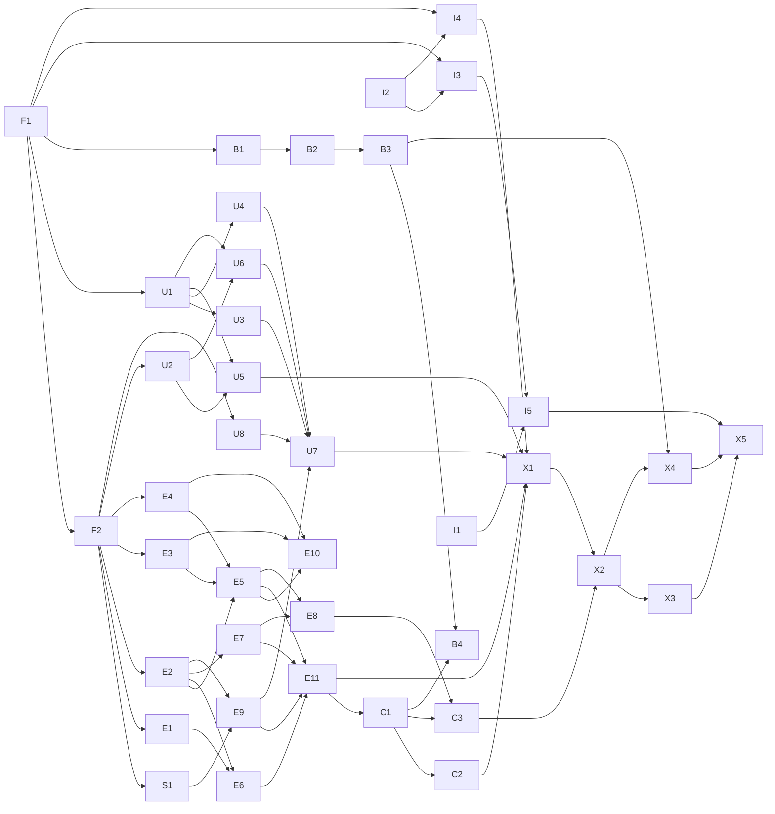

# Inference Simulator — 00 Build Plan

Status: ready to build (September 2026).
Related docs: 01–06 (design; kickoff decisions K1–K21 are applied in place and logged in each doc's decision log), `CLAUDE.md` (working conventions).

Docs 01–06 say **what** to build. This doc says **in what order, by whom, and to what standard**. If this doc and a design doc disagree, stop and ask the author; don't pick one.

## 1. How to use this doc

- Find your work package (WP) in §5. It lists its dependencies, the paths it owns, its scope, and when it is done.
- Read the design sections your WP cites. You don't need the rest.
- Edit only your owned paths. If you need a change elsewhere, and especially to a contract (§4), stop and ask the integrator (§6).
- A WP is done when its "Done when" list holds and `pnpm verify` passes on your branch rebased onto `main`.
- Build status lives in `docs/build-status.md`. F1 creates it, and after that only the integrator edits it.

## 2. Definition of done for v1

- All six tabs play from their entry points. Each tab's lesson assertions (§7.3) pass on the measured calibration.
- Live and High-side views work on every tab.
- The budgets in §8 are met in current Chrome on a mid-range laptop from 2023 or later.
- The production-CSP smoke test passes against the deployed site.
- The author has signed off on every tab's lesson and copy, and the persona checklist (01 §2) is complete.
- The site is deployed at `SITE_DOMAIN` from `prod`.

## 3. Milestones and gates

| Milestone | Contents | Gate |
|---|---|---|
| M0 Foundation | F1, F2; CI green on `main` | Integrator reviews the contracts |
| M1 Engine core | E1–E7, E9–E11; S1 report | **G1 (author), early in M1:** review the S1 report and fix the budgets (§8) and storage strategy before E9 and E11 commit to one. M1 closes when E11 runs a Server B day under `pnpm perf`. |
| M2 Vertical slice | Tabs 1–3 end to end on provisional calibration: U1–U7, C1, C2, I4, X1 | **G2 (author):** tabs 1–3 teach their lessons; first deploy optional |
| M3 Fleet | E8, C3, X2: tabs 4–6 | **G3 (author):** tabs 4–6 teach their lessons |
| M4 Calibrated | B1–B4; X4 swaps in measured calibration and retunes | Integrator; author reviews the before/after table |
| M5 Launch | X3 review, I5 bootstrap, X5 deploy and verification | **Author** |

Tracks B (benchmarks) and I (infra) start at M0 and run alongside. They join the app at M4 and M5, or at M2 if the author wants an early deploy.

## 4. Contracts (frozen at M0)

F2 writes these as TypeScript types with doc comments on `main` before parallel work starts. Every parallel WP depends on them. They change only through the integrator (§6).

| Contract | File | Defines |
|---|---|---|
| Time | `src/engine/time.ts` | `SimMs` (ms from Monday 00:00), `DayIndex`, day and rollup-delivery helpers |
| Calibration | `src/engine/calibration.ts`, loaded by `src/data/calibration.ts` | The type of `calibration.json` (03 §8) including `status`, plus the GPU and model constants the cost model needs; `parseCalibration` validator. The engine takes a Calibration as a parameter; only `src/data` imports the JSON. |
| Engine API | `src/engine/api.ts` | `SimConfig` (fixed per scenario) with `TunableParams` (drawer-tunable); `Patch` (lasting `set` or one-shot `event`, K21) and `PatchTemplate`; `DayRunInput`, `DayRun` (`advance`, `checkpoint`), `Engine` (`createDayRun`, `restoreDayRun`, `sessionPlan`) |
| Histograms | `src/engine/histogram.ts` | Log-spaced bin specs per metric, `binIndex`, exact merge, `quantile`. Shared by E9 and the charts. |
| Result chunk | `src/engine/results.ts` | Columnar `ResultChunk`: scalar buckets (metric list with aggregation kinds), histogram buckets, request records and transitions (scope `all` or `tracked`), replica events, `RollupRow`; allocation helpers and `chunkTransferables` |
| Worker protocol | `src/worker/protocol.ts` | `MainToWorker` and `WorkerToMain` messages, `WorkerScenario`, tracked-analyst rules, and the fork cut rule (documented at the top of the file) |
| Playback and view model | `src/playback/types.ts` | `PlaybackStore`, `PlaybackState`, `ResultsIndex` (the queries renderers use), and view data: `SceneState` for the canvas, `SeriesData`/`QuantileData`/`RequestPoints` for charts, `StatusSnapshot` for the status line |
| Scenario | `src/scenarios/schema.ts` | `Scenario` (preset, `SimConfig`, baseline patches, lesson moment, entry point, trigger, named fix, tracked rule, chart 3 kind, drawer parameters, copy, status templates) and `toWorkerScenario` |
| Fixtures | `src/fixtures/` | `makeFixtureChunks` (contract-shaped chunks for U2), `createFakeIndex` (an analytic `ResultsIndex` for renderers), `fixtureScenarios` (six placeholder tabs) |

Units and naming: simulated time is milliseconds from Monday 00:00, with no time zones. Put units in names (`ttftMs`, `kvTokens`, `weightBytes`).

## 5. Work packages

Every WP lists **Depends on**, **Owns** (the paths it may edit), **Scope**, and **Done when**. A WP whose dependencies are only contracts (§4) can start as soon as F2 merges.

### Track F — Foundation (sequential, on `main`)

**F1 · Scaffold and tooling**
- **Depends on:** nothing.
- **Owns:** root configs, `package.json`, `pnpm-lock.yaml`, `.github/workflows/ci.yml`, `.gitignore`, `src/main.tsx`, `src/App.tsx` (a shell only), `README.md`, `docs/build-status.md`.
- **Scope:**
  - Vite + React + TypeScript (strict) with pnpm on Node 22, Tailwind CSS v4, ESLint flat config, Prettier, Vitest with jsdom and Testing Library, and Playwright (Chromium only).
  - ESLint implements every rule in 04 §5, including the engine boundary (`src/engine` may not import from UI folders or `src/worker`, and may not reference `window` or `document`), the network and storage bans, the `Math.random` ban in `src/engine`, and named exports only. `spikes/` is ignored.
  - Install the whole stack up front so later WPs rarely touch `package.json`: `react`, `react-dom`, `d3-scale`, `d3-shape`, `d3-array`, `d3-interpolate`, `d3-timer`, `d3-time-format` and their types, `motion`, `tailwindcss`, `vitest`, `@testing-library/react`, `jsdom`, `@playwright/test`, and `tsx` for scripts.
  - Scripts: `dev`, `build`, `preview`, `lint`, `typecheck`, `test`, `e2e`, and `verify` (lint + typecheck + test + build).
  - `ci.yml` runs on every push and pull request (K19) with install, lint, typecheck, test, and build. I3 and I4 add their own steps later.
  - `.gitignore` covers 06 §4 plus `node_modules`, `dist`, and Playwright output.
  - Create `docs/build-status.md` as a table: WP, status, branch, notes.
- **Done when:** `pnpm verify` passes on the placeholder app, and a lint fixture test shows each restriction firing: `Math.random` in the engine, `fetch`, `localStorage`, a default export, and a DOM reference in the engine.

**F2 · Contracts, provisional calibration, fixtures**
- **Depends on:** F1.
- **Owns:** the contract files in §4, `benchmarks/derived/calibration.json`, `benchmarks/derived/calibration.provisional.md`, `src/fixtures/`.
- **Scope:**
  - Write the §4 contracts.
  - Write the provisional calibration in the 03 §8 shape with `"status": "provisional"`:
    - KV pool ~140k tokens (03 §3), block size 16.
    - η_c ≈ 0.5, η_b ≈ 0.8, t_o ≈ 4 ms.
    - Plausible cold-start phases.
    - Record each value's source in `calibration.provisional.md`.
  - Write a fixture generator that emits contract-shaped result chunks for 1, 2, 4, and 8 replicas, with a diurnal load, a KV ramp, preemptions, a crash and rejoin, and a rollup. Commit small fixtures, which the UI track uses until E11 lands.
- **Done when:** the contracts typecheck, the fixtures validate against them, and the integrator has reviewed the contracts, which are expensive to change later.

### Track S — Scale spike

**S1 · Scale spike** (throwaway code; the report stays)
- **Depends on:** F2. It may reuse E1 and E3 if they have merged.
- **Owns:** `spikes/scale/` (not bundled, deleted after G1), `docs/spikes/s1-scale.md`.
- **Scope:**
  - Build a deliberately simplified single-day Server B engine in Node: paged KV without content hashing, a decode-first scheduler, round-robin routing, and load at the knee (several hundred analysts per replica, 02 §5).
  - Measure:
    - events per simulated day and events per second;
    - simulated seconds per wall second at peak and during the morning ramp;
    - heap per million requests with columnar records;
    - cost of a checkpoint `structuredClone`;
    - memory and percentile error for candidate histogram resolutions.
  - Recommend:
    - chunk size and checkpoint interval;
    - histogram bucket width and bin ratio;
    - full per-request records vs. detail on demand (02 §11, K7);
    - how early in a shift a lesson moment must fall to meet P1 (§8).
- **Done when:** the report gives numbers, recommendations, and a pass or fail against each budget in §8. The author reviews it at G1.

### Track E — Engine (`src/engine`, `src/worker`)

All engine code is pure TS with keyed randomness (CLAUDE.md). Each module exposes `assertInvariants()`, which the tests call after every step.

**E1 · Keyed RNG and distributions**
- **Depends on:** F2. **Owns:** `src/engine/rng/`.
- **Scope:**
  - A counter-based generator, where a draw is a pure function of (seed, source, ...keys) (02 §12, K6). Use integer mixing with `Math.imul` so integer outputs are identical across JS engines.
  - Distributions: uniform, exponential, lognormal (median and σ), geometric (mean), a think-time family (gamma or log-logistic; pick one and justify it), and weighted choice.
- **Done when:** the same key gives the same value; means and variances fall within tolerance over 10⁵ draws; changing one key field gives uncorrelated output.

**E2 · Event core and day runner**
- **Depends on:** F2. **Owns:** `src/engine/core/`.
- **Scope:**
  - A binary-heap event queue with deterministic ties (time, then event-kind priority, then sequence number) and the simulation clock.
  - The `advance(untilMs)` loop, which dispatches to handlers that other modules register.
  - The day lifecycle from the standard morning state (K21), chunk emission cadence, and checkpoint and restore via `structuredClone`.
- **Done when:** the heap passes property tests; with a toy model, checkpoint then restore then advance gives output identical to an uninterrupted run; simulated time never decreases.

**E3 · Cost model**
- **Depends on:** F2. **Owns:** `src/engine/cost/`.
- **Scope:**
  - Step time per 02 §6 from prefill tokens, decode sequences, attended context tokens, and KV written, using the calibration.
  - The closed-form duration of k decode-only steps as context grows, including a switch between memory-bound and compute-bound regimes inside the span, and its inverse (how many steps fit before time T).
  - Busy time and achieved FLOPs for the two utilization metrics (02 §11).
- **Done when:**
  - The closed forms match a summed loop to 10⁻⁹ relative on random inputs.
  - A test table gives batch-1 TTFT and TPOT at 1k, 8k, 32k, and 120k context under the provisional calibration, checked by hand against 02 §6.
  - TPOT grows with context as K3 describes.

**E4 · KV block manager and prefix cache**
- **Depends on:** F2. **Owns:** `src/engine/kv/`.
- **Scope:** 02 §7 rules 3 and 5.
  - A fixed pool of `kvPoolTokens / blockSize` blocks.
  - Block identity:
    - System-prompt blocks are keyed by block index and shared across sessions.
    - History blocks are keyed by (session, block index), since history only grows.
    - Only full blocks are cacheable.
  - Reference counts; freed blocks stay cached and evictable; LRU eviction among unreferenced blocks.
  - Longest-cached-prefix lookup, and allocation that reports what it evicted (for the Evict metric and "session went cold").
- **Done when:** free + referenced + cached-evictable = total after every operation (property test over random operation sequences); LRU order and prefix lookup are verified.

**E5 · Replica scheduler with event-jumping**
- **Depends on:** E2, E3, E4 (can start against their contracts). **Owns:** `src/engine/replica/`.
- **Scope:**
  - 02 §7 rules 1–4:
    - waiting and running queues;
    - decodes first, then prefill chunks up to `max_num_batched_tokens` within `max_num_seqs`;
    - admission when blocks for the uncached prompt are free;
    - block growth at block boundaries;
    - preemption of the most recently admitted running request, with recompute.
  - Event-jumping (02 §5): from a fixed batch, find the next event and jump there using E3's closed forms. Candidate events are a finish, a prefill-chunk completion, the block crossing that exhausts the pool, and the next external event.
  - Client timeouts abort the request and free its blocks (02 §8).
  - Report transitions and metrics through E9's recorder.
- **Done when:** each rule has unit tests; E10's oracle agrees; invariants hold (every request is in exactly one state, and blocks are accounted for).

**E6 · Load generator and client**
- **Depends on:** E1, E2. **Owns:** `src/engine/load/`.
- **Scope:** 02 §8.
  - Per-day diurnal session starts over shift hours; population = analysts per replica × replicas.
  - Session scripts sampled at creation (K6): turn count, message and output lengths, think times.
  - Prompt construction: system prompt + history + new message, with block identities for E4.
  - The session coherence rule (turn N+1 waits for turn N).
  - Client behaviour (K8): timeout to first token; retry policies with keyed jitter; max retries; abandonment.
  - The one-shot patches for tabs 1–3: long prompt, rate step, long conversations.
- **Done when:**
  - Pairing test: two different router policies under the same seed produce the same set of (session, turn, lengths).
  - Distributions match their parameters.
  - Retries and abandonment have unit tests.

**E7 · Router**
- **Depends on:** E2. **Owns:** `src/engine/router/`.
- **Scope:** 02 §7.
  - Five policies. Session affinity uses mod-N or consistent hashing; the consistent-hashing ring has virtual nodes.
  - Load signals sampled with a configurable delay.
  - An exact outstanding count for admission control (K9).
  - Routing-set changes on mark-down and rejoin, and the router overhead constant.
- **Done when:**
  - Over 10k session IDs going from 8 to 7 replicas, mod-N moves 7/8 ± 0.03 of sessions and consistent hashing moves 1/8 ± 0.03.
  - A delayed-signal test shows a burst piling onto a replica that looked idle.
  - The admission cap scales with Ready replicas.

**E8 · Failure and recovery**
- **Depends on:** E5, E7. **Owns:** `src/engine/failure/`.
- **Scope:** 02 §9.
  - A crash fails in-flight requests and wipes KV.
  - Detection delay, then mark-down.
  - Load phases from the calibration's replacement-host cold start, then rejoin with an empty cache.
  - Replica state transitions for the canvas and the status line.
- **Done when:**
  - State durations match the calibration.
  - Failed requests reach E6's retries.
  - No blocks leak across a crash.
  - A rejoin under least-outstanding shows the cold-traffic flood.

**E9 · Metrics, results, rollup**
- **Depends on:** E2; follows the S1 recommendations after G1. **Owns:** `src/engine/metrics/`.
- **Scope:** 02 §11.
  - The recorder that E5–E8 write to.
  - Bucketed metrics per replica and for the fleet.
  - Log-spaced histograms at the S1-chosen resolution, with merge and percentile functions shared with the charts.
  - Per-request storage per S1: columnar records or detail windows.
  - The tracked-analyst trace; High-side rollup rows with delivery at day N+1 12:00 (01 §8); lesson-moment and fork markers.
- **Done when:**
  - Histogram merge is exact, and percentile error stays within the S1 bound on test distributions.
  - On a small run, rollup rows equal a direct computation from the records.
  - Chunks serialize to transferable buffers.

**E10 · Differential oracle**
- **Depends on:** E3, E4, E5. **Owns:** `src/engine/oracle/` and `*.oracle.test.ts`.
- **Scope:**
  - A slow, obviously correct simulator that ticks every engine step for one replica, plus a two-replica variant using E7.
  - It shares E3 and E4 but has its own plain scheduler loop.
  - A seeded generator of small workloads (≤300 requests, mixed lengths, some filling the KV pool, some timing out).
- **Done when:**
  - Over 200 seeds in `pnpm test`, the engine and the oracle agree on every request's first-token and finish times (≤10⁻⁶ relative), preemption counts, and cached-token counts.
  - `pnpm test:oracle:long` runs 5,000 seeds.
  - A failure prints the seed and the first diverging event.

**E11 · Engine assembly and worker host**
- **Depends on:** E5, E6, E7, E9; adds E8 when it merges. **Owns:** `src/engine/index.ts`, `src/engine/headless.ts`, `src/worker/` (except `protocol.ts`), `scripts/perf.ts`.
- **Scope:**
  - Wire the modules into the Engine API (§4).
  - Worker host (04 §3, K11, K21):
    - Compute the focused day first, then the other days.
    - Chunked `advance` with transferable results.
    - Checkpoints at the S1 interval.
    - Fork: restore, replay to t, apply the patch, then recompute the rest of the day, and later days too if the patch is lasting.
    - Reset, detail requests, and tracked-analyst selection by the scenario's rule.
  - `headless.ts` for Node runs.
  - `pnpm perf`, which reports budgets P3 and P4 (§8).
- **Done when:**
  - A fork gives results identical to a fresh run with the patch applied at t.
  - `pnpm perf` numbers for a Server B day are recorded in `docs/build-status.md`.
  - The worker loads under the production CSP (I4).

### Track U — UI (`src/ui`, `src/sim-view`, `src/charts`, `src/playback`)

UI WPs build against the F2 fixtures until E11 lands, then switch to the real engine client with no component changes.

**U1 · Design tokens and app shell**
- **Depends on:** F1. **Owns:** `src/ui/theme/`, `src/ui/primitives/`, `src/ui/shell/`, `src/index.css`.
- **Scope:**
  - The 70/30 layout at 1440×900, scrolling down to 1280×720, with a notice below that (K15).
  - A colorblind-safe palette with a secondary cue (shape or outline) for dot states (queued, prefill, decode, preempted) and replica states (Ready, Down, Loading) (05 §7, 05 open item 2).
  - Type: a system stack or self-hosted fonts, never a font CDN (06 §5).
  - Primitives (button, segmented toggle, tabs, drawer, modal, tooltip), all keyboard-operable. Motion transitions are off under `prefers-reduced-motion` (K18).
- **Done when:** the primitives have keyboard tests, and the palette is documented with its checks under deuteranopia and protanopia simulation and its contrast ratios.

**U2 · Engine client and playback store**
- **Depends on:** F2. **Owns:** `src/playback/` (except `types.ts`).
- **Scope:**
  - The playback store: playhead, speed 1×–1000×, play and pause, mode, computed ranges.
  - A requestAnimationFrame driver that skips off-shift hours and holds with a buffering flag at uncomputed time (K16, 05 §5).
  - An engine client with one interface over two backends: the worker, or a fixture-backed fake. It assembles chunks into a results index queryable by time range and replica, and sends focus, fork, reset, and track.
  - Fork markers.
  - The canvas subscribes outside React; React components use throttled selectors.
- **Done when:** unit tests with the fake engine cover play, pause, speed, scrub, night skip, buffering hold, fork (history before t kept, marker recorded), and reset.

**U8 · Results index** (split from U2 at kickoff so the two run in parallel)
- **Depends on:** F2. **Owns:** `src/playback/index/`.
- **Scope:** `createResultsStore(replicas)` implementing `ResultsStore` and `ResultsIndex` (`src/playback/types.ts`) over stored chunks:
  - Per-day chunk storage with binary search by time; the fork cut rule; revision-free (U2 filters stale messages).
  - `scalarSeries` aggregates buckets to at most `columns` points using each metric's aggregation kind; `quantileSeries` merges histograms; NaN for uncomputed time.
  - `requestPoints`, `sceneAt` (dots from transitions where detail exists, aggregate otherwise; the tracked analyst's requests always), `statusAt`, `rollup`, `completedDays`.
- **Done when:** unit tests against fixture chunks cover aggregation per kind, quantiles against direct histogram merges, the cut rule, scene reconstruction at arbitrary times, and query cost on a full Server B week of fixture chunks (report timings).

**U3 · Canvas renderer**
- **Depends on:** U1, F2. **Owns:** `src/sim-view/`.
- **Scope:** 05 §7. A pure `draw(ctx, stateAtT, viewport, mode)` that draws:
  - the router on the left and replicas on the right, each with a KV tank and state-colored dots;
  - the tracked analyst's requests traced across replicas, labeled with TTFT;
  - Down and Loading replica states (with phase), and an empty tank on rejoin;
  - aggregate flow above the speed threshold (05 open item 4);
  - in High-side mode, only the replica outlines (05 §9).

  It also handles click-to-track hit testing, HiDPI, and layouts for 1 to 8 replicas.
- **Done when:** it renders every fixture; a frame takes ≤4 ms at 8 replicas with ~1,000 dots; hit testing has unit tests.

**U4 · Charts**
- **Depends on:** U1, F2. **Owns:** `src/charts/`.
- **Scope:** 05 §6.
  - One shared time axis and zoom for all three charts.
  - Chart 1: TTFT mean vs. p99, with E2E p99 secondary (K14). Chart 2: KV % with preemption markers. Chart 3: its variants.
  - A fleet line with the worst replica highlighted.
  - At most one bucket per pixel column. Percentiles use E9's functions, and sparse buckets fall back to individual points.
  - High-side mode: daily bars per replica and "not collected on the high side" panels (05 §9). The collapse is tweened with d3-interpolate and d3-timer (K13).
  - A playhead cursor.
- **Done when:** every fixture renders in both modes; decimation tests show a path never has more points than there are pixel columns; percentiles match E9's reference.

**U5 · Week timeline**
- **Depends on:** U1, U2. **Owns:** `src/ui/timeline/`.
- **Scope:** 05 §5. It shows:
  - days, with off-shift hours shaded;
  - the lesson-moment marker and fork markers;
  - computed ranges;
  - the playhead.

  Scrubbing works with the pointer and the keyboard.
- **Done when:** component tests cover scrubbing, keyboard input, and marker rendering from store state.

**U6 · App chrome and sidebar**
- **Depends on:** U1, U2. **Owns:** `src/ui/chrome/`, `src/ui/sidebar/`, and `src/App.tsx` layout composition until X1.
- **Scope:**
  - Six tabs, with the Extrapolated label where it applies.
  - The toolbar: trigger, Live/High-side toggle, play/pause, speed, jump to lesson moment, Reset (05 §4, K16).
  - The parameters drawer, generated from the scenario's descriptors; every change is a fork.
  - The intro modal on every load, using the 05 §2 draft text.
  - The sidebar (05 §8, K17):
    - "What to watch" and "Try this";
    - the live status line, with template evaluation against playhead state in an `aria-live` region;
    - the collapsible rollup table;
    - the footnote, which uses provisional wording while the calibration status is provisional.
- **Done when:**
  - Component tests cover drawer changes producing forks, the toggle, Reset, and the modal.
  - Status templates evaluate correctly against fixture states.
  - Placeholder copy is marked `TODO(copy)`.

**U7 · High-side integration**
- **Depends on:** U3, U4, U6, E9. **Owns:** `src/ui/high-side/` (glue only).
- **Scope:** switching modes end to end per 05 §9 and 01 §8.
  - A day's rollup appears once the playhead passes the next day's 12:00, and the current day stays empty.
  - Switching back to Live restores the same run.
- **Done when:** a test moves the playhead across day boundaries and checks which rollup rows are visible.

### Track C — Scenarios and content (`src/scenarios`)

**C1 · Scenario runner and lesson helpers**
- **Depends on:** E11. **Owns:** `scripts/sim.ts`, `src/scenarios/testing/`.
- **Scope:**
  - `pnpm sim <tab> [--day N] [--patch key=value ...]` runs a scenario headless and prints a lesson summary: TTFT mean and p99 around the lesson moment, KV %, preemptions, cache hit rate by policy, per-replica load, amplification, and sessions moved.
  - Helpers that let the lesson assertions read like the lesson, such as "returning-turn TTFT p50 under policy X".
- **Done when:** it runs every registered scenario, and the helpers have unit tests.

**C2 · Scenarios, tabs 1–3**
- **Depends on:** C1. The assertions run headless; the in-app review happens at X1. **Owns:** `src/scenarios/tab1-long-prompt/`, `tab2-knee/`, `tab3-kv/`.
- **Scope:** each tab's full scenario (§4 schema):
  - lesson moment on Monday to Thursday (K2), early enough in the shift to meet P1 (§8);
  - entry point, trigger, drawer parameters, tracked-analyst rule;
  - copy and status templates;
  - `lessons.test.ts` (§7.3).

  Tune until the assertions pass with margin, keeping parameter values plausible, and note each value's rationale next to it. Write copy last, after the numbers are known. The copy must describe what the simulator actually shows (K3).
- **Done when:** the lesson assertions pass on the provisional calibration, the handoff note includes each tab's `pnpm sim` summary, and the author reviews at G2.

**C3 · Scenarios, tabs 4–6**
- **Depends on:** C1, E8. **Owns:** `src/scenarios/tab4-routing/`, `tab5-fail-recover/`, `tab6-retry-storm/`.
- **Scope:** the same as C2, covering the concept-to-tab mapping (01 §5, K4). Watch tab 4's parameter window (02 §14 item 5).
- **Done when:** the same as C2, reviewed at G3.

### Track B — Benchmarks (`benchmarks/`)

Ask the author before anything touches the GPUs, and confirm both are free (`nvidia-smi`). The author runs privileged steps personally (03 §5, K10).

**B1 · Environment and harness**
- **Depends on:** F1 (repo layout only). **Owns:** `benchmarks/` except `raw/`, `derived/`, `validation/`, `RUNS.md`, and `scripts/derive*`.
- **Scope:**
  - A uv project pinning vLLM 0.20.1 and the 03 §2 stack. The model comes from the local Hugging Face cache.
  - The wrapper (03 §5):
    - start and stop vLLM with NUMA pinning;
    - timestamp startup phases;
    - scrape `/metrics` and sample NVML once a second;
    - write a scrubbed `manifest.json` (no hostnames, usernames, or tokens);
    - check that prefix-cache hits stay at 0 on R1 and R2.
  - Run definitions for R0–R8 as config files, with proposed sweep points (03 open item 1).
  - A `--dry-run` that prints every command without touching the GPUs.
- **Done when:** the dry run prints the full plan, and a short R0 run completes after the author approves it.

**B2 · Run R0–R8**
- **Depends on:** B1 and author approval. **Owns:** `benchmarks/raw/`, `benchmarks/RUNS.md`.
- **Scope:**
  - Run 03 §6.
  - For R7, prepare the exact privileged commands (drop caches, move the compile cache aside) and wait for the author to run them.
  - Note power-limited intervals and anomalies in the manifests.
- **Done when:** every run is committed with its manifest, and `RUNS.md` logs them.

**B3 · Derivation and fit report**
- **Depends on:** B2 (development can start against B1's smoke data). **Owns:** `benchmarks/scripts/derive*`, `benchmarks/derived/` except `calibration.json`.
- **Scope:**
  - Fit η_c from R1, and η_b and t_o from R2.
  - Take the engine constants from R0, cold-start phases from R7 (all three conditions recorded; the app uses replacement host), and warm vs. cold TTFT from R6.
  - Write `derived/calibration.measured.json` with `"status": "measured"`.
  - Write `derived/report.md` with residuals across each fit's range and the η_c split check (03 open item 3).
- **Done when:** one command reproduces the derivation from raw data.

**B4 · Simulator validation**
- **Depends on:** B3, C1. **Owns:** `benchmarks/validation/`.
- **Scope:**
  - Drive the simulator with the R3, R4, and R5 workloads.
  - Compare against the measurements: TTFT and TPOT p50/p99 per rate step, knee location, preemption onset, and KV % trajectory.
  - This is for internal use only; the app makes no accuracy claim (01 §9).
- **Done when:** `validation/report.md` has side-by-side tables and a list of known gaps.

### Track I — Infra and delivery (`infra/`, `.github/`, `e2e/`)

Never run `terraform apply`, AWS write commands, or `gh secret set`. Prepare them for the author.

**I1 · Terraform bootstrap**
- **Depends on:** nothing. **Owns:** `infra/bootstrap/`, `infra/README.md`.
- **Scope:**
  - 06 §3 bootstrap: the OIDC provider; the deploy role trusted only for `refs/heads/prod`, with least privilege and state-bucket access limited to the site key (K20); the state bucket.
  - The runbook in `infra/README.md`: apply locally, migrate the state into the bucket, set the three secrets, create `prod`.
- **Done when:** `terraform fmt -check` and `terraform validate` pass, and no account IDs or ARNs are committed.

**I2 · Terraform site**
- **Depends on:** nothing. **Owns:** `infra/site/`, including `headers.json`.
- **Scope:** 06 §3, §5–§7.
  - Private bucket with OAC.
  - CloudFront with the root object, HTTPS redirect, cache behaviours, and a response headers policy read from `headers.json`.
  - ACM in us-east-1 with DNS validation.
  - Route 53 A and AAAA aliases.
  - A log bucket with a 90-day lifecycle, fed by standard logging v2.
  - Variables `site_domain` and the zone name; outputs for the deploy workflow.
- **Done when:** `fmt` and `validate` pass with no backend, and `headers.json` matches 06 §5 exactly.

**I3 · Deploy workflow**
- **Depends on:** F1, I2. **Owns:** `.github/workflows/deploy.yml` and the Terraform steps in `ci.yml`.
- **Scope:**
  - 06 §4: a concurrency group, OIDC, `terraform init/plan/apply`, `aws s3 sync` with per-path cache headers (06 §6), and invalidation of `/index.html`.
  - Actions pinned to full commit SHAs.
  - `ci.yml` gains `terraform fmt -check` and `terraform validate`.
- **Done when:** `actionlint` passes (install it if it's missing) and the integrator has checked the workflow against the 06 §4 table.

**I4 · Production-CSP smoke test**
- **Depends on:** F1, I2. **Owns:** `e2e/`, `scripts/serve-prod.ts`, the e2e step in `ci.yml`.
- **Scope:**
  - A small static server that serves `dist/` with the headers from `infra/site/headers.json`.
  - A Playwright test that:
    - listens for `securitypolicyviolation` events and console errors, and logs every request;
    - dismisses the modal and visits each registered tab;
    - plays briefly, toggles High side, changes one drawer parameter, and presses Reset.
  - It fails on any CSP violation, console error, cross-origin request, or fetch/XHR.
  - `BASE_URL` points it at the deployed site (X5).
- **Done when:** it passes in CI, and it was shown once (not committed) to fail on an inline worker and on an inline `<style>`.

**I5 · Bootstrap and first deploy** (the author runs it)
- **Depends on:** I1, I2, I3, and an app worth deploying (M2 or later). **Owns:** nothing in the repo.
- **Scope:** the author follows `infra/README.md`. An agent can watch `gh run` output and diagnose failures.
- **Done when:** the site serves at `SITE_DOMAIN`.

### Track X — Integration, review, release

**X1 · Vertical-slice integration (M2)**
- **Depends on:** E11, U1–U7, C2, I4. **Owns:** `src/App.tsx`, `src/scenarios/index.ts` (the registry).
- **Scope:**
  - Swap the fixtures for the worker and register tabs 1–3. The registry decides which tabs exist, so an early deploy shows only finished tabs.
  - Measure the §8 budgets in Chrome.
  - Fix integration bugs. A non-trivial fix becomes a small follow-up WP in the owner's path.
- **Done when:** the G2 checklist (§7.5) passes.

**X2 · Fleet integration (M3)**
- **Depends on:** X1, E8, C3. **Owns:** the registry.
- **Scope:** register tabs 4–6 and measure the Server B budgets in Chrome.
- **Done when:** the G3 checklist passes.

**X3 · Review pass**
- **Depends on:** X2. **Owns:** copy files in `src/scenarios/*/` and small UI fixes, coordinated with the integrator.
- **Scope:**
  - The persona checklist per tab (01 §2).
  - A keyboard-only walkthrough and a reduced-motion check (K18).
  - A copy edit for accuracy against the simulator and for the docs' plain voice, plus the final intro text (05 §2).
  - Screenshots of every tab in both modes at 1440×900 and 1280×720 for the author.
- **Done when:** the author signs off.

**X4 · Calibration swap (M4)**
- **Depends on:** B3, X2. **Owns:** `benchmarks/derived/calibration.json` and the scenario parameter values.
- **Scope:**
  - Promote `calibration.measured.json` to `calibration.json`.
  - Rerun the lesson assertions and `pnpm sim` summaries.
  - Retune any scenario that fails, and update its rationale notes.
  - Once the status reads `measured`, the footnote drops its provisional wording automatically.
- **Done when:** every lesson assertion passes on the measured calibration, and the handoff note has a before/after table.

**X5 · Launch (M5)**
- **Depends on:** X3, X4, I5. **Owns:** nothing new.
- **Scope:** the author merges `main` into `prod` and pushes. Then check:
  - `curl -sI` shows the 06 §5 headers and the 06 §6 cache headers;
  - I4 passes with `BASE_URL` set to the site;
  - every tab loads on a cold cache;
  - logs arrive in the log bucket.
- **Done when:** every check passes.

## 6. Parallel work protocol

Integration is local (K19): one worktree and branch per WP, merged into `main` by the integrator. The author pushes.

- **Integrator.** The lead session, or the author. It:
  - creates worktrees and assigns WPs;
  - reviews handoff notes and merges;
  - keeps `docs/build-status.md` current;
  - owns the shared files: `package.json`, the lockfile, root configs, `ci.yml` (except the steps I3 and I4 own), the §4 contracts, `CLAUDE.md`, and `docs/`.

  A lead Claude session spawns WP agents with the Agent tool and `isolation: "worktree"`, one WP per agent, passing the WP ID and a pointer to this doc.
- **Manual worktrees.** Run `git worktree add ../inference-simulator.wt/<wp> -b wp/<wp>-<slug> main`, then `pnpm install` inside it.
- **Ownership.** Edit only your owned paths and your own tests. Reading anything is fine. No two active WPs own the same path.
- **Contract changes.** Stop and describe the change. The integrator commits it on `main` on its own, and dependents rebase. You may prototype an additive optional field in your branch, but flag it at the top of your handoff note.
- **Dependencies.** F1 installs the stack. If you need another package, ask the integrator, who adds it on `main`, so lockfile conflicts happen once.
- **Handoff.**
  - Rebase onto current `main` and make sure `pnpm verify` is green.
  - Prefix commits with the WP ID (`E4: ...`).
  - Write a short handoff note covering what changed, what's left, what the integrator must know, and any contract change.
- **Merge.** The integrator squash-merges with the message `WP <id>: <title>` and the handoff note as the body. It then reruns `pnpm verify` on `main`, updates build status, and removes the worktree. If `main` breaks, revert the merge first and fix afterwards.
- **Concurrency.** Up to about eight WPs at once. A WP that started against contracts rebases and re-verifies once its real dependencies merge.
- **Pushing.** Agents never push. The author pushes `main` (CI runs) and promotes to `prod`.

### Waves (a guide, not a rule; the dependency lists in §5 are authoritative)

| Wave | Starts when | WPs in parallel |
|---|---|---|
| 0 | Now | F1, then F2 |
| 1 | F2 merged | S1, E1, E2, E3, E4, U1, U2, U8, B1, I1, I2 |
| 2 | Wave-1 dependencies (E9 also waits for G1) | E5, E6, E7, E9, U3, U4, U5, U6, I3, I4, B2 (on approval) |
| 3 | E5–E9 | E10, E11, E8, B3 |
| 4 | E11 | C1, then C2; U7; then X1 (**G2**) |
| 5 | C1 and E8 | C3, then X2 (**G3**); B4 |
| 6 | B3 and X2 | X4, X3, I5, then X5 |

## 7. Test and evaluation strategy (K12)

### 7.1 Unit tests

Vitest, in `*.test.ts(x)` files next to the code. Engine tests call `assertInvariants()` after every step. The invariants are:

- request conservation: arrived = finished + failed + aborted + rejected + in flight;
- block accounting (E4);
- simulated time never decreases;
- every running request holds its blocks;
- no request is in two states.

### 7.2 Differential oracle

E10. Every `pnpm test` runs 200 seeds. Run `pnpm test:oracle:long` (5,000 seeds) before merging any change to E3, E4, E5, or E7.

### 7.3 Lesson assertions

Each scenario ships a `lessons.test.ts` that runs its lesson day headless and asserts the lesson. These are proposed starting thresholds. C2 and C3 finalize them with the author, and the assertions should pass with margin.

| Tab | Proposed assertion |
|---|---|
| All | (lesson moment − entry point) ÷ default speed ≤ 45 s of wall time |
| 1 | Long-prompt TTFT ≥ 20× the short-prompt median. Long-prompt TPOT ≤ 1.35× short-prompt TPOT (K3). |
| 2 | From the day's 50%-load point to the lesson moment, TTFT p99 rises by ≥ 3× as many milliseconds as the TTFT mean, and p99 ends ≥ 4× its 50%-load value |
| 3 | KV ≥ 95% for ≥ 10 simulated minutes. Preemptions > 0. Recomputed prefill ≥ 10% of prefill tokens in that window. nvidia-smi-style utilization ≥ 90% while compute utilization ≤ η_c / 2 (25% at the provisional η_c = 0.5; compute utilization can never exceed η_c, so a fixed 50% bound would always pass). TTFT p99 ≥ 3× its pre-moment value while token throughput stays within 10%. |
| 4 | Returning-turn cache hit rate ≥ 0.7 under affinity and ≤ 1/N + 0.1 under round-robin. Round-robin returning-turn TTFT p50 ≥ 2× affinity's. Replica-load imbalance is higher under affinity than under least-outstanding. With mean turns = 1, round-robin and affinity TTFT p50 are within 10% of each other (c1). |
| 5 | Sessions moved by the crash: ≥ 0.8 under mod-N, ≤ 0.2 under consistent hashing. Fleet TTFT p99 over the 30 minutes after the crash ≥ 2× the pre-crash value. After rejoin under least-outstanding, the rejoined replica's hit rate is near 0 and its outstanding count exceeds the fleet mean at first. |
| 6 | Immediate retries with short timeouts: amplification ≥ 2× and goodput < 50% of organic demand for ≥ 10 minutes. With backoff, jitter, and admission control: amplification ≤ 1.3× and goodput back to ≥ 90% within 15 minutes. |

If a lesson only appears under implausible parameters, raise it with the author; don't force it.

### 7.4 Production-CSP smoke test

I4. It runs in CI on every push, and against the live site at X5.

### 7.5 Gate checklists (manual)

**G2 (tabs 1–3) and G3 (tabs 4–6), on each tab:**

- From the entry point, pressing Play shows the lesson within about a minute.
- The sidebar copy matches what is on screen.
- The trigger's fork reads clearly on the charts and timeline.
- High side hides the incident's shape, and switching back restores it.
- The persona checklist (01 §2) is complete.
- The §8 budgets are measured and recorded.

### 7.6 Evaluation of the model itself

B4 compares the simulator with the R3–R5 measurements. It's internal only and informs tuning and caveats, never a public claim.

### 7.7 Budgets

These are checked by `pnpm perf` and a Chrome performance recording at G1, M2, M3, and before launch. Not in CI (K12).

## 8. Budgets (initial; revisit at G1)

| ID | Budget | Target | Measured by |
|---|---|---|---|
| P1 | Tab entry or Reset to first playable frame, Server B | ≤ 3 s | Chrome, from the click to the first frame |
| P2 | Fork to first updated frame | ≤ 1 s | Chrome |
| P3 | Engine speed at Server B peak | ≥ 1,000 simulated s per wall s, so 1000× playback doesn't stall after the initial lead | `pnpm perf` |
| P4 | Peak memory, main thread plus worker, full Server B week | ≤ 400 MB | Chrome task manager, `pnpm perf` heap |
| P5 | Main-thread long tasks during playback at any speed | None > 50 ms | Chrome performance panel |
| P6 | Initial JS, gzip | ≤ 300 KB | `vite build` report |

P1 depends on how far into its day a tab's entry point sits, because the worker computes from that day's morning (K21). S1 reports the latest viable entry time, and C2 and C3 place lesson moments to fit it.

## 9. Deployment

- **Environments.** There is one: `prod`. `pnpm preview` plus the smoke test stands in for staging.
- **First deploy.** Optional at M2 (the registry shows only finished tabs); required at M5. The author runs I5, then X5.
- **Rollback.** `git revert` on `prod` and push. The deploy re-syncs the previous build, and Terraform rolls back the same way.
- **Cost.** A few dollars a month at most at demo traffic. The Route 53 zone already exists; S3 storage costs cents; demo traffic stays within CloudFront's always-free tier; logs expire after 90 days. There is no HA, alerting, or staging, by design.

## 10. Risks

| Risk | Early signal | Mitigation |
|---|---|---|
| The engine is too slow or too large at Server B scale | S1 | G1 budgets; detail on demand; coarser histograms; heavier requests with fewer analysts per replica |
| Event-jumping bugs | E10 | The oracle must pass before merge |
| Lessons need implausible parameters (tab 4's window especially) | C1 summaries | Tune against the assertions; escalate to the author rather than force it |
| Measured calibration moves a lesson | X4 | The assertions catch it; retune |
| The CSP breaks the production build | I4 in CI | One headers file for Terraform and tests |
| Parallel agents collide | Merge conflicts | Path ownership, frozen contracts, integrator-only shared files |
| GPU contention on the host | Other processes in `nvidia-smi` | Ask first; track B never blocks app work |
| Scope creep | New features in handoff notes | 01 §4 out-of-scope list; park ideas in a v2 list in `docs/build-status.md` |
