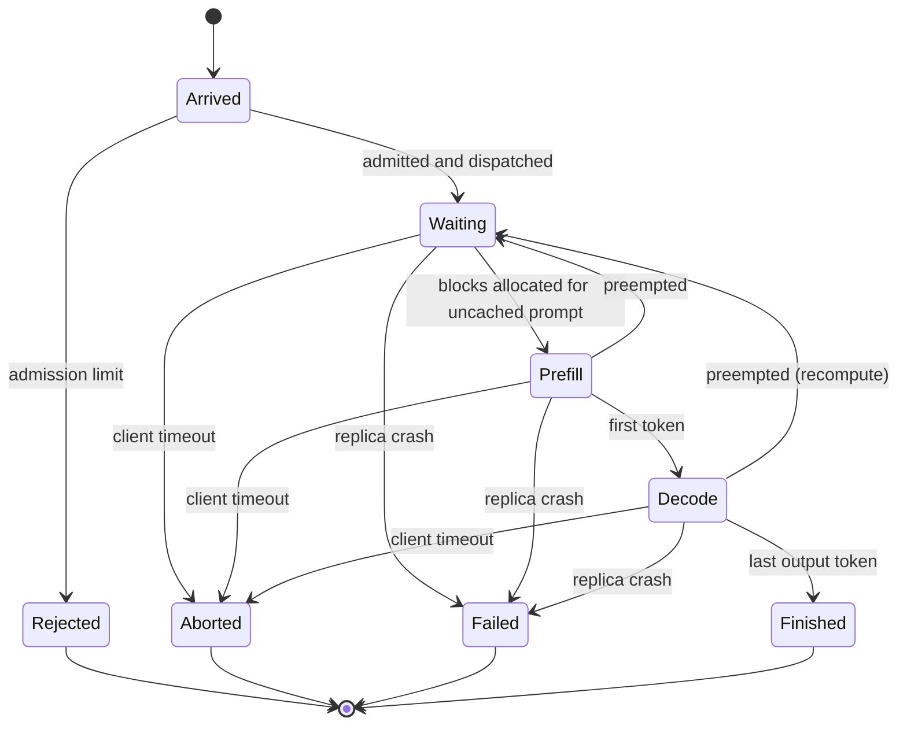

# Inference Simulator — 02 Simulator

Status: scoping complete; kickoff review applied (September 2026).
Related docs: 00-build (build plan), 01-product-and-rationale (lessons and scope), 03-benchmarks (calibration inputs), 04-stack (runtime).

## 1. Principles

- A pure TypeScript engine with no DOM access. It runs in a Web Worker, advances incrementally, and checkpoints its state (04 §3, K11).
- Every random draw is keyed: a pure function of the seed, the random source, and the entity it belongs to (§12, K6).
- Discrete-event simulation with event-jumping: time jumps from one event to the next instead of ticking every engine step.
- The per-replica scheduler mirrors vLLM V1.
- Step duration comes from a roofline model with three calibrated numbers.
- The simulator knows every request's output length; the router does not.

## 2. Fixed constants

| Constant | Value | Source |
|---|---|---|
| Model | Llama 3.1 8B Instruct, FP16 | 03-benchmarks |
| Weights | ~16.06 GB (8.03B params × 2 bytes) | Computed |
| KV per token | 128 KiB (32 layers × 8 KV heads × 128 dim × 2 for K and V × 2 bytes) | Computed |
| KV pool per replica | Measured value from vLLM startup log (estimate ~140k tokens); shown to the user | 03-benchmarks R0 |
| KV block size | Measured engine value (vLLM default) | Run manifest |
| Max context length | 128k tokens (Llama 3.1 default; not capped) | Theme 3 Q2 |
| GPU | A100 PCIe 40GB, 250 W; peak dense FP16 312 TFLOPS; 1,555 GB/s | Spec sheet |
| Calibration | Compute efficiency η_c, bandwidth efficiency η_b, per-step overhead t_o | 03-benchmarks R1–R2 |
| Engine config | Chunked prefill on; prefix caching on; max_num_seqs and max_num_batched_tokens as benchmarked | Run manifest |
| Parallelism | TP=1; 1 GPU = 1 replica | Scope |
| Replicas per preset | 1, 2 (measured); 4 Server A, 8 Server B (extrapolated) | 01 §7 |
| Cold start | Replacement-host durations: weight load, engine init, ready | 03-benchmarks R7 |
| Router overhead | Fixed added latency constant | Hardware doc caveat |
| Horizon | 5-day work week per tab | Theme 1 Q13 |

## 3. Request lifecycle



Rejected, Aborted, and Failed requests may spawn a Retry, which is a new Arrive after the backoff delay. The server aborts a request when its client times out (Theme 2 Q7).

## 4. Events

| Event | Trigger | Effect |
|---|---|---|
| Arrive | Open-loop session start, Next turn, or Retry | Request created at the router |
| Admit / Reject | Router admission control | Admitted requests are dispatched; rejected ones return an error, and retry policy applies |
| Dispatch | Routing policy | Request joins a replica's waiting queue |
| First token | Last prefill chunk completes | TTFT recorded; request enters decode |
| Finish | Final output token | E2E latency recorded; blocks released and kept in prefix cache as evictable |
| Preempt | A running request cannot get a KV block | Most recently admitted running request is freed and requeued |
| Evict | A free block holding cached content is reused | That history is lost from this replica; the session goes cold |
| Timeout | Client timeout elapses | Server aborts the request and frees its blocks; client may retry |
| Retry | Retry policy after Timeout, Reject, or Failed | New Arrive after backoff |
| Replica fail | Scenario trigger (crash) | In-flight requests fail at once; KV contents lost |
| Mark-down | Router detects the failure | Replica removed from the routing set |
| Replica load start / Ready | Recovery | Weight load, then engine init, then Ready; rejoins with an empty cache |
| Next turn | Think time elapses (see §8) | Arrive for the session's next turn |

Internal events not shown to the user: prefill chunk boundary, KV-full threshold, metric bucket flush.

Mapping from the draft list: Admin/reject became Admit/Reject; Prefill-complete became First token; Decode step became a computed quantity; "Prompt" was read as Preempt; Recover split into Load start and Ready. Evict, Timeout, Mark-down, and Next turn were added.

## 5. Time advance: event-jumping

Between events the batch composition on a replica is fixed. The engine computes when the next event occurs and advances directly to it. Candidates for the next event:

- next arrival (pre-sampled open-loop schedule)
- next finish (output length known to the simulator)
- next prefill chunk completion
- KV pool exhaustion (free blocks ÷ blocks consumed per step)
- next client timeout
- scheduled failure or recovery phase

Step duration grows as context grows, so the time for k decode steps is a sum over a growing series and is solved analytically. Token counts at any instant remain computable, so the canvas can animate per token.

Expected scale (revised, K7). A replica limited by KV serves roughly 3 requests/s at ~300-token outputs, so reaching the knee takes several hundred analysts per replica. A Server B work week at knee-level load is then about 1.5–2M requests and 10–15M events, against tens of millions of engine steps. Near the knee a new arrival lands every ~10 decode steps, so event-jumping saves about one order of magnitude, not two. These are estimates; the scale spike in 00-build (S1) measures the real figures.

## 6. Step cost model (roofline, three calibrated numbers)

```
compute_time = FLOPs / (η_c × 312 TFLOPS)
memory_time  = bytes / (η_b × 1,555 GB/s)
step_time    = t_o + max(compute_time, memory_time)

FLOPs ≈ 2 × 8.03e9 × (prefill tokens + decode sequences) + attention FLOPs (∝ tokens × context)
bytes ≈ 16.06 GB weights + 128 KiB × (context tokens attended across the batch) + KV written
```

- η_c is fitted to TTFT vs. prompt length (compute-bound prefill).
- η_b is fitted to batch-1 TPOT (memory-bound decode).
- t_o is the residual per-step overhead.
- The 250 W power cap is absorbed into η_c and η_b. It lowers compute throughput more than bandwidth, which is why one global factor was rejected (Theme 3 Q1).

## 7. Scheduling rules

### Per replica, per step (mirrors vLLM V1)

1. **Admission to running.** A waiting request is scheduled when blocks for its uncached prompt tokens are free. Prefix-cache hits reduce the blocks needed. No blocks are reserved for future output.
2. **Step composition.** Running decodes go first, one token each. Prefill chunks fill the remaining token budget (max_num_batched_tokens), within the max_num_seqs cap.
3. **Block growth.** Decode allocates a new block each time a request crosses a block boundary.
4. **Preemption.** If a running request cannot get a block, the most recently admitted running request is preempted: its blocks are freed and it goes to the front of the waiting queue. It recomputes when rescheduled. Recompute is the only preemption mode.
5. **Prefix cache.** Blocks are identified by content hash. Freed blocks stay cached until reused, with LRU eviction among unreferenced blocks. A preempted request can therefore recover part of its prefill if its blocks were not reused.

### Router (fleet level)

- **Admission control** (tab 6 fix, K9): a cap on requests outstanding across the fleet, meaning dispatched and not yet finished. The router tracks this count exactly, without signal delay. The cap is a per-replica limit × Ready replicas, so it shrinks when a replica goes down. Requests above the cap are rejected immediately.
- **Routing signals:** refreshed with a configurable delay, so bursts can pile onto a replica that looked idle.

| Policy | Signal used | Notes |
|---|---|---|
| Round-robin | None | Ignores load |
| Least-outstanding | In-flight request count per replica | Counts requests, not cost |
| Session affinity (prefix-aware) | hash(session ID) → replica; scheme is mod-N or consistent hashing | Blind to eviction; the scheme parameter drives the remapping lesson |
| KV-utilization | Replica KV % | — |
| Weighted scoring | Weighted sum of affinity match, outstanding count, KV % | Weights are tunable |

## 8. Load generator

- **Arrivals:** open loop (Theme 2 Q4). Session starts follow a diurnal curve over analyst shift hours across a five-day work week.
- **Independent days (K21):** each shift day starts from a standard morning state: empty queues, all replicas Ready, and only the shared system prompt cached. No session spans two days. A day's run is a pure function of (seed, scenario, day, changes in effect that day), so days can be computed in any order. The worker computes the lesson day first (04 §3). A change applied at time t recomputes the rest of that day. A lasting change (a parameter such as routing policy) also recomputes later days; a one-shot event (a crash, a long prompt) does not.
- **Population:** analysts per replica × replica count (Theme 1 Q9).
- **Session turns:** turn N+1 is scheduled at turn N's arrival plus a think time. If turn N is still running, turn N+1 waits client-side until turn N completes. Load stays open-loop across the population, and each session stays coherent. Under overload this means turn N+1 follows turn N's completion with no think time. That is deliberate, because it keeps load open-loop.
- **Session history:** turn N+1's prompt = system prompt + all prior user messages and outputs + the new message. Shared system prompt length is a parameter.
- **Session scripts (K6):** when a session is created, its whole script is sampled from keyed draws: turn count, each turn's message and output lengths, and each think time. Policy changes therefore never reassign lengths between requests.
- **Distributions:** parametric (Theme 2 Q5):
  - new-message length and output length: lognormal
  - turns per session: geometric
  - think time: log-logistic (median, shape β), K23. It has a closed-form inverse (one uniform per keyed draw), the median is a direct parameter, and its power-law tail produces the long absences that decide whether KV history survives (tab 4). Keep β > 2 for a finite variance; the load generator caps think time at the shift's end.
- **Client behavior (K8):**
  - The timeout runs to the first token. A streaming client gives up when nothing has arrived; once tokens flow, there is no timeout.
  - Retry policies are immediate, fixed, exponential, and full jitter. Jitter is keyed by (request, attempt). Max retries is a parameter.
  - When a turn exhausts its retries, it fails and the analyst abandons the session, sending no further turns. Abandoned sessions are counted.
  - Failed, aborted, and rejected turns never enter session history.
- **Incident injection:** each tab's one-click trigger (§10).

Default parameter values are set during the build and documented in code.

## 9. Failure model

- **Mode:** crash (Theme 2 Q6). Connections reset; in-flight requests fail immediately; clients retry per policy.
- **Detection:** Mark-down follows the crash after a short detection delay.
- **Recovery:** load start (weights from cold page cache), engine init (cold compile cache plus graph capture), then Ready. Durations are measured under replacement-host conditions (03-benchmarks R7). The replica rejoins with an empty KV cache. Under least-outstanding it receives a flood of cold traffic.

## 10. Behaviours

Each tab's baseline week contains its lesson moment at a scheduled day and time. The trigger forks the run at the playhead and re-applies the same change there (K1, 01 §6).

| Tab | Preset | Trigger | What changes visually | Lesson | Fix | Third chart |
|---|---|---|---|---|---|---|
| 1 Long prompt | 1 GPU, 1 analyst | Send a long prompt (default 16–32k tokens) next to short ones | The long request's dot stays in prefill color longer; TTFT jumps while TPOT rises only slightly | TTFT scales with prompt length; TPOT grows only slowly because the weights dominate each step's memory traffic (prefill vs. decode, K3) | — | Utilization (nvidia-smi vs. compute) |
| 2 Saturation knee | 1 GPU | Raise the arrival rate toward capacity | Waiting queue grows; mean latency rises slowly while p99 separates sharply | p99 diverges from the mean near capacity; averages hide it | — | Utilization |
| 3 KV exhaustion | 1 GPU | Long conversations and outputs | KV tank reaches ~98%; dots turn preempted color and return to the queue; preemption markers; nvidia-smi near 100% while compute stays low | The ceiling is memory; preemption recomputes paid-for prefill; throughput flat while p99 knees | — | Utilization |
| 4 Routing | 2 replicas | Switch routing policy | Tracked analyst's follow-ups land on another replica and re-prefill; TTFT rises; per-replica load shifts | Least-busy can be wrong; affinity trades imbalance for TTFT | Switch to session affinity or weighted | Per-replica load |
| 5 Replica fail and recover | Server B (proposed) | Crash a replica | Replica goes dark; its sessions re-dispatch and recompute; survivors' KV fills. On recovery: cold-start phases, empty tank, possible flood. Mod-N vs. consistent hashing changes how many sessions move. | Loss impact exceeds 1/N; cold start plus cold cache; remapping | — | Per-replica load |
| 6 Retry storm | Server A (proposed) | Crash or spike with short timeouts and immediate retries | Offered load climbs above organic arrivals; queues grow. With the fix: rejects appear, backoff spreads retries, the system recovers. | Timeouts and retries amplify outages; backoff and admission control contain them | Backoff with jitter plus admission control | Offered vs. admitted load |

## 11. Metrics emitted

**Per request:** request, session, analyst, and replica IDs; timestamps (arrive, admit, dispatch, first token, finish or abort); prompt tokens; cached tokens; output tokens; preemption count; retry count; outcome.

Storage (K7): per-request data is columnar (typed arrays), never one object per request. At Server B scale that is millions of records. If full records for the week exceed the memory budget in 00-build, full records are kept only for the tracked analyst. The canvas then gets its request detail near the playhead by re-simulating from the nearest checkpoint. The scale spike (00-build S1) makes this choice.

**Per session:** turns completed, outcome (completed or abandoned).

**Per replica, per time bucket:**

- KV usage %
- running and waiting counts
- preemptions
- prefix-cache hits and queries
- prefill and decode tokens/s
- nvidia-smi-style utilization (fraction of time a step is executing)
- compute utilization (achieved FLOPs ÷ peak)
- requests served

**Fleet, per time bucket:** offered load, admitted load, rejects, retries, amplification factor, abandoned sessions.

**Latency distributions:** TTFT, TPOT/ITL, and E2E stored as fixed log-spaced histograms per bucket (Theme 2 Q8). Histograms merge exactly to any zoom window, with about 1–2% error.

**High-side rollup (derived):** per replica per day, requests served, mean E2E latency, and mean nvidia-smi-style utilization. Delivered 12 hours after the day closes.

## 12. Determinism

- **Keyed draws (K6):** every draw comes from a counter-based PRNG and is a pure function of (seed, source, entity key). Examples: (session) for session start and script, (session, turn) for lengths and think time, (request, attempt) for retry jitter, (replica, incident) for failures. Separate sequential streams per source are not enough. A policy change reorders completions, so sequential draws would land on different requests and break pairing. With keyed draws, changing a policy never shifts arrival times or reassigns lengths, so policy comparisons are paired.
- **Repeatability scope:** the same seed in the same browser engine gives an identical run (Theme 4 Q5). `Math.exp` and `Math.log` are implementation-approximated in ECMAScript, so other engines may differ in the last bit.

## 13. Decision log (Theme 2)

| ID | Question | Options considered | Decision |
|---|---|---|---|
| — | Event list critique | Preempt, First token, and computed decode steps; add Evict, Timeout, Mark-down, Ready, Next turn | Accepted |
| Q1 | How does time advance? | Tick every step; event-jumping; hybrid | Event-jumping |
| Q2 | Step duration model? | Lookup tables; fitted linear; roofline with calibration | Roofline; refined in Theme 3 Q1 to three numbers (η_c, η_b, t_o) |
| Q3 | Scheduler fidelity? | Mirror vLLM V1; simplified reservation; V1 with toggles | Mirror vLLM V1 |
| Q4 | Arrival model? | Open loop; closed-loop sessions; hybrid | Open loop, with the session-coherence rule in §8 |
| Q5 | Length and think-time source? | Parametric; empirical trace; parametric fitted to a trace | Parametric |
| Q6 | Failure mode? | Crash; hang; both | Crash |
| Q7 | Work after client timeout? | Abort on disconnect; keep generating; toggle | Abort on disconnect (vLLM behavior) |
| Q8 | Percentiles across zoom levels? | Exact from records; mergeable histograms; fixed windows | Fixed log-spaced histograms per bucket |

**Kickoff review (September 2026).** See 01 §11 for K1–K5.

| ID | Question | Options considered | Decision |
|---|---|---|---|
| K6 | Do per-source PRNG streams keep policy comparisons paired? | Sequential stream per source; keyed counter-based draws | Keyed draws with per-session scripts sampled at creation (§8, §12) |
| K7 | Scale and per-request storage | Keep the ~1M-event estimate; revise and budget | Revised to ~10–15M events for a Server B week; columnar storage; a memory budget set in 00-build; S1 decides between full records and re-simulating detail on demand |
| K8 | Client semantics | Timeout to first token vs. total; on retry exhaustion skip the turn vs. abandon the session | Timeout to first token; the session is abandoned after retries are exhausted; failed turns never enter history |
| K9 | Form of the admission limit (open item 2) | Queue at the router; per-replica in-flight cap; fleet outstanding cap | Fleet outstanding cap = per-replica limit × Ready replicas, tracked exactly by the router |
| K21 | Tabs open mid-week; a continuous week needs ~8M events before tab 5's first frame | Independent days; continuous week with checkpoints shipped in the build; continuous week behind a loading screen | Independent days from a standard morning state (§8); the lesson day is computed first |
| K23 | Think-time distribution family (§8) | Gamma; log-logistic; exponential | Log-logistic (median, shape): closed-form inverse, median as a parameter, a realistic heavy tail |
| K27 | Same-instant ordering and patch timing (decided in E2) | — | At one instant: patches first, then infrastructure (failure and recovery), then the engine, then client timeouts, then the router, then arrivals. The engine going before client timeouts means a first token landing exactly at the timeout counts (K8). 'set' patches dated before a day apply before any module initialises; patches inside the day, including one at exactly midnight, apply first at their instant. Modules share three notification topics: firstToken, requestEnded, replicaState. |

## 14. Open items

1. Default values for all load-generator distributions and client timeout and retry parameters.
2. Default admission limit per replica (form decided in K9).
3. Default router signal refresh delay and crash detection delay.
4. Lesson-moment day and time per tab: Monday to Thursday (K2); exact values are set in scenario tuning.
5. Tab 4 parameter window. Under affinity, a session's history must usually survive its think time in the KV pool, or the routing lesson disappears. With hundreds of sessions per replica, LRU churn can evict histories even under perfect affinity. The tab 4 lesson assertions in 00-build check this.
