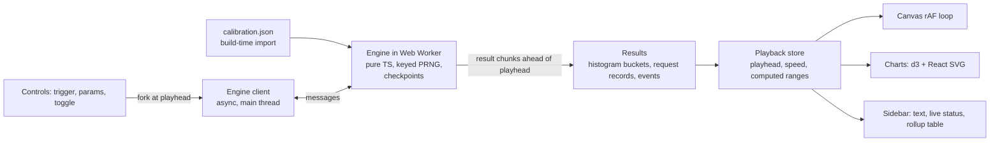

# Inference Simulator — 04 Stack

Status: scoping complete; kickoff review applied (September 2026).
Related docs: 00-build (build plan), 02-simulator (engine design), 05-ui-ux (what is rendered), 06-deployment (hosting and CSP).

## 1. Stack summary

| Layer | Choice | Notes |
|---|---|---|
| App | React + Vite + TypeScript | Static SPA |
| Package manager | pnpm on Node 22 LTS | — |
| Styling | Tailwind CSS | Also handles simple CSS transitions |
| UI animation | Motion (MIT) | Modal, tabs, sidebar, drawer transitions |
| Simulator pane | Canvas 2D with a `requestAnimationFrame` loop | Draws the state at the playhead; pure function of simulation time |
| Charts | d3 for scales, axes, and path generation; React renders SVG | Stated exception to the no-SVG rule, which applies to the simulator pane |
| Chart transitions | d3-interpolate and d3-timer tween chart data; React renders each frame (K13) | Includes the Live to High-side collapse. d3-transition is not used, because it would mutate DOM that React owns. |
| Simulation engine | Pure TypeScript, no DOM, keyed PRNG | Web Worker, incremental, checkpointed; see §3 (K11) |
| Tests | Vitest: unit tests, a differential oracle, scenario lesson assertions. Playwright: one smoke test of the production build under the production CSP. | K12; details in 00-build |
| Lint and format | ESLint + Prettier | Rules in §5 |

**Not used:** three.js, GSAP, a Python backend, client-side routing, localStorage, sessionStorage, runtime network calls.

## 2. Why not GSAP

The draft preferred GSAP unless something did the job better. Three things need animating here, and none needs GSAP:

1. **Canvas dots and KV tanks** must be a pure function of simulation time, because playback pauses, scrubs, forks, and changes speed. Tween libraries run on wall-clock time and drift from the simulation. A rAF loop that draws the state at the playhead needs no library.
2. **The chart collapse** from Live to High side is a transition on the chart's own data, which d3 handles.
3. **UI chrome** needs simple fades and slides. Motion covers this declaratively in React.

GSAP's strengths (timelines, scroll-triggered sequencing) go unused. Its license is also proprietary: free under Webflow's standard no-charge license, which allows use on any website or app but is not OSI open source. A proprietary dependency is one more review item if anyone later clears the app for use inside an enclave.

## 3. Architecture



- **Where the engine runs (K11, supersedes Q1):** in a Web Worker from day one. The engine advances in chunks of simulated time and streams each chunk's results to the main thread, staying ahead of the playhead. Days are independent (02 §8, K21). The worker computes the playhead's day first, which at tab entry is the lesson day, then fills in the other days in the background. Playback starts once the computed range is safely ahead of the playhead. If the playhead reaches uncomputed time, playback holds with a buffering indicator.
- **Checkpoints:** the engine checkpoints its full state at a fixed simulated-time interval within each day (default 15 minutes; the scale spike tunes it). Each day's start is the standard morning state, so no checkpoint crosses a day boundary. State is plain data (queues, block tables, typed arrays, RNG keys), so `structuredClone` can copy it.
- **Mid-week changes (Q2):** fork at the playhead. The worker restores the nearest checkpoint at or before t, replays to t, applies the change, and streams from t to the end of that day. A lasting change also recomputes later days from their mornings. Results before t are kept, and charts mark the fork time.
- **Worker bundling:** `new Worker(new URL('./engine.worker.ts', import.meta.url), { type: 'module' })`. Never use an inline worker (`?worker&inline`): it loads from a `blob:` URL, which `worker-src 'self'` blocks.
- **Chart density:** draw at most one bucket per pixel column, so SVG paths stay small at every zoom level.
- **Determinism (Q5):** the same seed in the same browser engine gives an identical run. Every draw is keyed by source and entity (see 02-simulator §12, K6).

## 4. Proposed source layout

```
src/
  engine/        # pure TS: events, scheduler, router, cost model, load generator, metrics
  engine/rng/    # keyed PRNG and distributions
  engine/oracle/ # naive step-by-step reference simulator (imported by tests only)
  worker/        # Web Worker entry and message protocol
  playback/      # engine client, playback store, fork handling
  sim-view/      # canvas renderer
  charts/        # d3 scales, React SVG charts
  ui/            # tabs, toolbar, drawer, sidebar, modal, tooltips
  scenarios/     # per-tab definitions: preset, seed, lesson moment, trigger, parameters, sidebar text
  data/          # calibration loader (imports benchmarks/derived/calibration.json at build time)
e2e/             # Playwright smoke test of the production build
scripts/         # headless scenario runner, perf harness, fixtures
```

## 5. Code and runtime rules

| Rule | Enforcement |
|---|---|
| Small files | Review; lint max-lines threshold set during build |
| Named exports only | `import/no-default-export`, with an override for React lazy-boundary files |
| No runtime network calls | `no-restricted-globals` for `fetch`, `XMLHttpRequest`, `WebSocket`, `EventSource`; CSP `connect-src 'none'` (06-deployment) |
| No browser storage | `no-restricted-globals` for `localStorage`, `sessionStorage`, `indexedDB` |
| No client-side routing | No router dependency |
| Keyed randomness only | `no-restricted-properties` for `Math.random` in `src/engine` |
| No DOM in engine | Lint boundary: `src/engine` may not import from UI folders or reference `window` or `document` |
| No three.js | Dependency review |
| No SVG in simulator pane | Review; charts are the stated exception |
| No inline workers | Review; CSP `worker-src 'self'` blocks `blob:` workers, and the Playwright smoke test fails on the violation |

## 6. Decision log (Theme 4)

| ID | Question | Options considered | Decision |
|---|---|---|---|
| Q1 | Where does the engine run? | Main thread, full week at load; Worker, full week at load; Worker streaming ahead | Main thread, full week at load (Worker as fallback) (superseded by K11) |
| Q2 | Mid-week parameter changes? | Restart from t=0 and seek; fork at playhead; edit only while paused | Fork at playhead |
| Q3 | Animation library? | GSAP; Motion; none | Motion for UI chrome; rAF canvas; d3 chart transitions |
| Q4 | Chart rendering? | d3 math plus React SVG; d3-owned DOM; canvas series | d3 math plus React SVG |
| Q5 | What does "repeatable" promise? | Same engine; cross-engine via pure-JS math; same engine plus shareable seeds | Same seed, same browser engine |
| Q6 | Testing beyond unit tests? | Unit only; plus golden runs; plus property tests | Unit tests only (superseded by K12) |

**Kickoff review (September 2026).**

| ID | Question | Options considered | Decision |
|---|---|---|---|
| K11 | Where and how does the engine run, given ~10–15M events per Server B week (02 §5)? | Worker streaming ahead; Worker computing the full week first; main thread as decided | Web Worker from day one, streaming chunks ahead of the playhead, with periodic checkpoints; forks restore the nearest checkpoint (supersedes Q1) |
| K12 | Test layers | Unit only; plus differential oracle; plus lesson assertions; plus production-CSP smoke test; plus perf budget test in CI | Unit tests, a differential oracle, scenario lesson assertions, and one Playwright smoke test under the production CSP. Perf budgets are checked by a local harness, not in CI (supersedes Q6). |
| K13 | Chart transitions with React-owned SVG | d3-transition; tween data and let React render | Tween data with d3-interpolate and d3-timer; React renders |
| K30 | G1: how to meet P1 (first frame ≤ 3 s) given S1's measurements | Keep 3 s with early lesson moments on Server A/B; relax to 5 s; ship precomputed entry checkpoints | Keep 3 s. Server B tabs enter by 09:30 simulated time, Server A by about 12:00; small tabs are unconstrained. E4's block cycle gets faster (E4b). |

## 7. Open items

1. The scale spike (00-build S1) sets chunk size, checkpoint interval, histogram resolution, and per-request storage against the budgets in 00-build.
2. The event-jumping time calculations are the highest-risk code. The differential oracle (K12) checks them against step-by-step simulation.
