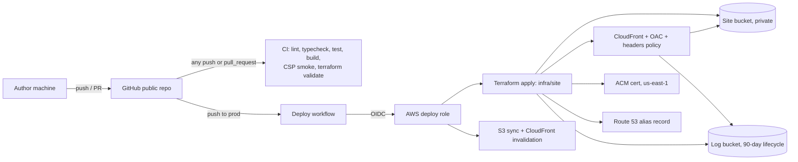

# Inference Simulator — 06 Deployment and CI/CD

Status: scoping complete; kickoff review applied (September 2026).
Related docs: 00-build (build plan, tracks I and X), 04-stack (runtime rules the CSP enforces), 03-benchmarks (repo layout for data).

## 1. Summary

- Static SPA with no backend and no runtime secrets.
- Hosted on AWS: S3 behind CloudFront, ACM certificate, Route 53 DNS.
- The site lives at a subdomain of yoschwab.com (subdomain to be provided). The yoschwab.com zone is in Route 53 in the same AWS account.
- Infrastructure is Terraform. CI applies it on push to `prod`.
- CI (lint, typecheck, tests, build, the production-CSP smoke test, and Terraform format and validate) runs on every push and every pull request (K19).
- GitHub Actions deploys on push to `prod` (a merge or a direct commit).
- Development integrates on `main`. Agents build each work package in its own worktree and branch, and an integrator merges them into `main` locally. The author pushes `main` and promotes `main` to `prod` (00-build §6).
- No release pipeline.
- Public GitHub repo. No secrets in any generated file, and secrets are never requested in conversation. (As of September 2026 the repo is still private; the author flips it before launch.)

## 2. Architecture



## 3. Terraform layout

**`infra/bootstrap/`** — applied locally, once. CI depends on these resources, so they must exist before any workflow runs.

- GitHub OIDC identity provider.
- Deploy role. Trust is scoped to the `prod` branch, audience `sts.amazonaws.com`. The subject is `<sub_claim_prefix>:ref:refs/heads/prod`. This repo was created after GitHub switched new repos to immutable OIDC subjects, so its prefix is `repo:<owner>@<owner-id>/<repo>@<repo-id>`, not `repo:<owner>/<repo>`. The author reads it from `gh api repos/<owner>/<repo>/actions/oidc/customization/sub` into the gitignored bootstrap tfvars (K22).
- Deploy role permissions: the site and log buckets; the state bucket, limited to the site stack's state key; CloudFront; ACM; and the Route 53 zone. No IAM write, because IAM stays in the bootstrap stack.
- State bucket: versioning, encryption, public access blocked.
- The bootstrap stack starts with local state. After the first apply, the author migrates it into the state bucket under its own key (`bootstrap/terraform.tfstate`), which the deploy role cannot touch (K20). It never enters the repo.

**`infra/site/`** — applied by CI on push to `prod`.

- Backend: S3 with native locking (`use_lockfile = true`, Terraform 1.10+). No DynamoDB table.
- Inputs: the zone name (`yoschwab.com`, committed as a default) and `site_domain`, supplied in CI from the `SITE_DOMAIN` secret.
- Site bucket: private, accessed only through CloudFront Origin Access Control.
- Log bucket: lifecycle rule deleting objects after 90 days. CloudFront standard logging v2 delivers to it, with no bucket ACLs (K20).
- CloudFront distribution:
  - default root object `index.html`
  - HTTPS redirect
  - cache behaviors per §6
  - response headers policy per §5
- ACM certificate in us-east-1 (required for CloudFront), with DNS validation records in Route 53.
- Route 53 alias A and AAAA records for the subdomain.

## 4. GitHub Actions

| Workflow | Trigger | Permissions | Steps |
|---|---|---|---|
| `ci.yml` | `push` (any branch) and `pull_request` (K19) | `contents: read` (no AWS) | Install, lint, typecheck, test, build, Playwright production-CSP smoke test, `terraform fmt -check` and `terraform validate` (no backend) |
| `deploy.yml` | `push` to `prod` | `id-token: write`, `contents: read` | Install, lint, typecheck, test, build, smoke test → assume role via OIDC → `terraform init/plan/apply` (infra/site; plan runs immediately before apply, K20) → `aws s3 sync` with cache headers → CloudFront invalidation of `/index.html` |

- Tests run in two tiers: CI on ordinary pushes and PRs runs `pnpm test:fast`, which skips the whole-day simulation tests (lesson assertions, worker, oracle; see `slowTests` in `vite.config.ts`). The `prod` ref, which gates deploys, runs the full suite. Contributors run `pnpm verify` (full) locally before pushing.
- `deploy.yml` uses a concurrency group so deploys never overlap.
- Third-party actions are pinned to full commit SHAs.
- Fork PRs receive no OIDC tokens, so CI for them runs without AWS access regardless of configuration.

**Account-specific values** (Q5: GitHub secrets). The author sets these; the repo never contains them.

| Secret | Contents |
|---|---|
| `AWS_DEPLOY_ROLE_ARN` | Role ARN output by the bootstrap stack |
| `TF_STATE_BUCKET` | State bucket name |
| `SITE_DOMAIN` | Full site hostname (the chosen subdomain of yoschwab.com) |

Setup commands, run on the author's machine (placeholders only; `gh secret set` prompts for the value). The repo already exists (private); flip visibility with `gh repo edit --visibility public` when ready.

```bash
git push -u origin prod
gh secret set AWS_DEPLOY_ROLE_ARN
gh secret set TF_STATE_BUCKET
gh secret set SITE_DOMAIN
```

`.gitignore` covers `*.tfstate*`, `.terraform/`, and `*.tfvars` (an example file with placeholders is committed).

## 5. Security headers

A CloudFront response headers policy provides the browser-level backstop for the no-network and no-storage rules. Proposed CSP:

```
default-src 'self'; script-src 'self'; style-src 'self'; img-src 'self' data:;
font-src 'self'; connect-src 'none'; worker-src 'self'; object-src 'none';
base-uri 'self'; form-action 'none'; frame-ancestors 'none'
```

- The header values live in one file, `infra/site/headers.json`. Terraform reads it for the response headers policy, and the Playwright smoke test serves the production build with the same headers, so the tested CSP is the deployed CSP.
- `connect-src 'none'` blocks any runtime network call from the page.
- `worker-src 'self'` covers the engine's Web Worker (04-stack §3). Inline (`blob:`) workers are blocked.
- Fonts are self-hosted; no third-party font CDN.
- Test `style-src 'self'` against the production build. If a dependency injects `<style>` elements, allow them by hash, or by `'unsafe-inline'` for styles only.
- Other headers:
  - HSTS: one year, including subdomains
  - `X-Content-Type-Options: nosniff`
  - `Referrer-Policy: no-referrer`
  - a minimal `Permissions-Policy`

## 6. Caching

| Path | Cache-Control | On deploy |
|---|---|---|
| `/assets/*` (Vite hashed) | `public, max-age=31536000, immutable` | New files; old files removed by `sync --delete` |
| `/index.html` | `no-cache` | Invalidated |

## 7. Usage measurement

CloudFront access logs go to the log bucket and are deleted after 90 days (Q6). This gives visit counts server-side, with no client code and no runtime network call. The logs contain visitor IP addresses. Legacy CloudFront standard logging requires ACLs enabled on the log bucket. v1 uses standard logging v2 instead, which delivers to S3 without ACLs (K20).

## 8. Decision log (Theme 6)

| ID | Question | Options considered | Decision |
|---|---|---|---|
| — | Conventions | OAC, us-east-1 certificate, hashed-asset caching, CSP, bootstrap stack | Accepted |
| Q1 | What happens on a PR into `prod`? | Build and test only; preview deploys; deploy to production | Build and test only; deploy on push to `prod` |
| Q2 | Who runs Terraform? | Local apply with CI sync only; CI plan and apply; CI plan only | CI runs plan on PRs and apply on push to `prod` (PR plans dropped by K20) |
| Q3 | Where is the yoschwab.com DNS zone? | Route 53 same account; other provider with delegation; Route 53 other account | Route 53, same account |
| Q4 | Deploy role trust scope? | `prod` branch; `production` environment; environment plus approval | `prod` branch |
| Q5 | Where do account-specific values live? | Hard-coded; GitHub variables; GitHub secrets | GitHub secrets |
| Q6 | Measure usage? | None; CloudFront access logs; client analytics | CloudFront access logs to S3, 90-day lifecycle |

**Kickoff review (September 2026).**

| ID | Question | Options considered | Decision |
|---|---|---|---|
| K19 | When does CI run, and how does work integrate? | PRs into `prod` only (as drafted); every push and PR | CI on every push and PR. Work packages integrate on `main` through local worktree merges; the author pushes and promotes to `prod`. |
| K20 | Open items 1, 3, and 4 | See §9 | (1) Option (a): no PR plans; `deploy.yml` plans immediately before apply (supersedes the PR-plan half of Q2). (3) Standard logging v2. (4) Migrate bootstrap state into the state bucket under its own key, out of the deploy role's reach. |
| K22 | Which OIDC subject does the deploy role trust? (Found in I1: GitHub gives repos created after 2026-07-15 immutable subject claims.) | Spec's `repo:<owner>/<repo>` form; the repo's immutable prefix | The repo's `sub_claim_prefix`, passed as a bootstrap variable from gitignored tfvars. Numeric IDs stay out of the repo. |

## 9. Open items

1. **Conflict between Q2 and Q4.** Resolved by K20: option (a). For the record, the options were:
   - **(a)** Drop PR plans. `deploy.yml` runs plan immediately before apply on push to `prod`. Simplest.
   - **(b)** Add a second, read-only plan role trusted for `repo:<owner>/<repo>:pull_request`. Same-repo PRs get a plan; fork PRs get no OIDC token anyway.
   - **(c)** Widen the deploy role's trust. Not recommended, because it gives PR runs write access.
2. The subdomain name (to be provided). It reaches Terraform through the `SITE_DOMAIN` secret.
3. Resolved by K20: standard logging v2.
4. Resolved by K20: bootstrap state migrates into the state bucket.
